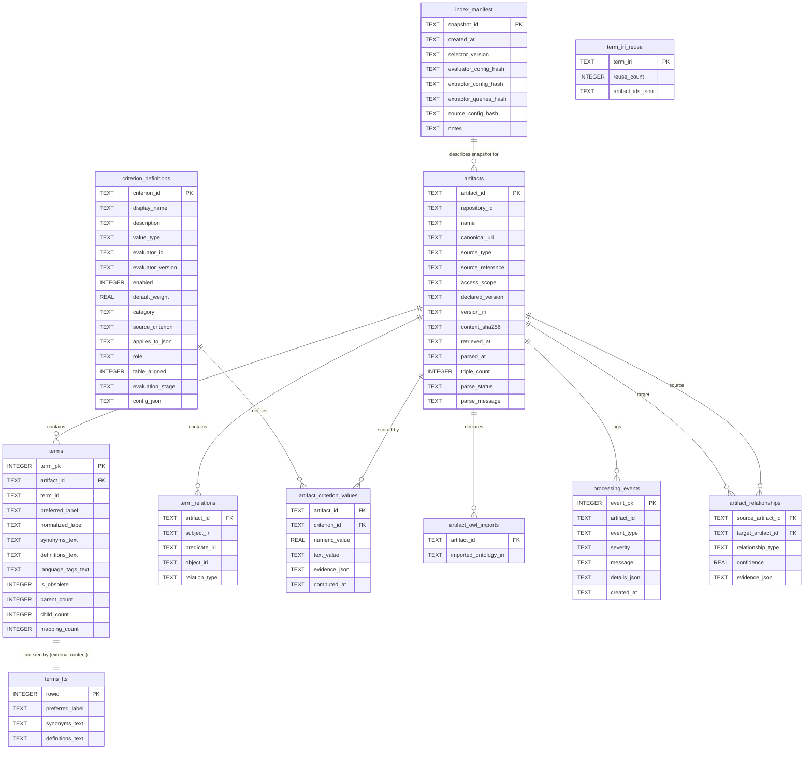
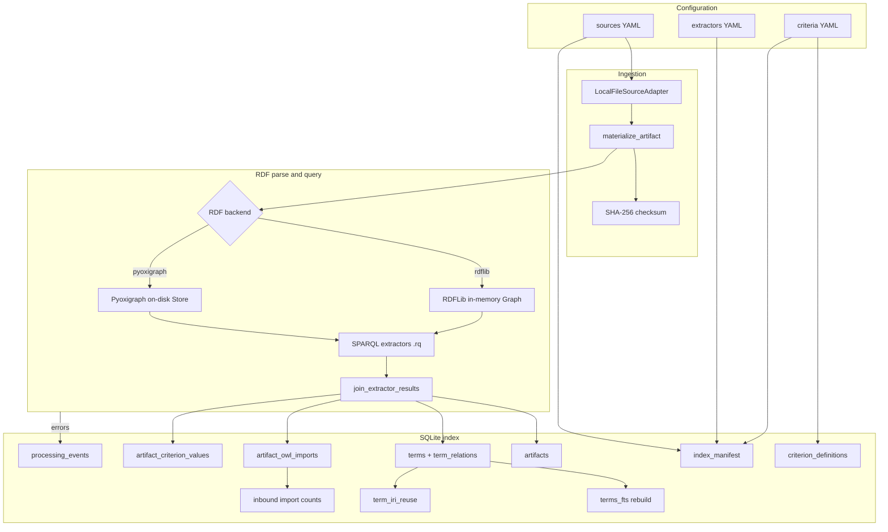

# Database structure and parsing pipeline

The Semantic Selector stores **derived** ontology content in a single SQLite file (for example `data/indexes/selector-index.sqlite`). Source OWL/RDF files are parsed only during index build; search and ranking read the precomputed index at query time.

Schema is defined in versioned SQL migrations under [`migrations/`](../migrations/) and applied by [`apply_migrations()`](../src/semantic_selector/db/schema.py) when `build-index` runs.

---

## Entity-relationship diagram

**Legend**

- Solid foreign keys use `ON DELETE CASCADE` from `artifacts` to child tables.
- `terms_fts` is an FTS5 virtual table with `content='terms'` (external-content mode); it mirrors searchable text from `terms` via triggers and a post-build rebuild.
- `term_iri_reuse` is a cross-artifact aggregate table (no FK to `artifacts`); it is populated after all artifacts are indexed.
- `artifact_relationships` is reserved for inferred links between artifacts (schema present; not populated by the current build pipeline).

---

## Build and parsing pipeline

### Step-by-step

1. **Load config** — `sources`, `extractors`, and `criteria` YAML files drive the build ([`build_index()`](../src/semantic_selector/services.py)).
2. **Create empty database** — migrations run on a temporary SQLite file; the finished index atomically replaces the output path.
3. **Write manifest** — one row in `index_manifest` records snapshot identity and content hashes of all config inputs for traceability.
4. **Register criteria** — rows in `criterion_definitions` from criteria YAML; evaluators with `evaluation_stage: index_build` run per artifact.
5. **For each configured artifact:**
   - Resolve the local file path and compute `content_sha256`.
   - **Parse RDF** into an RDF backend (`rdflib` or `pyoxigraph`, configured in sources YAML).
   - Run enabled **SPARQL extractors** against the loaded graph.
   - **Normalize** extractor rows into terms, relations, and metadata ([`join_extractor_results()`](../src/semantic_selector/extractors/normalization.py)).
   - Insert into `artifacts`, `terms`, `term_relations`, and `artifact_owl_imports`.
   - Run index-build evaluators; insert `artifact_criterion_values`.
   - Log failures to `processing_events` (`parse_error`, `extractor_error`, `evaluator_error`, `source_missing`).
6. **Post-build aggregates** — rebuild FTS, compute `term_iri_reuse`, and update cross-artifact criterion values such as `inbound_owl_import_count`.
7. **Validate** — orphan-term check, at least one successful parse, and FTS smoke test.

---

## RDF parsing

### Supported file formats

Format detection is extension-first, with RDFLib `guess_format` as fallback ([`infer_format()`](../src/semantic_selector/ingestion/parser.py)):

| Extension | RDFLib format |
|-----------|---------------|
| `.ttl` | `turtle` |
| `.rdf`, `.owl` | `xml` |
| `.jsonld` | `json-ld` |
| `.nt` | `nt` |
| `.n3` | `n3` |

### RDF backends

| Backend | Storage | Notes |
|---------|---------|-------|
| `rdflib` | In-memory `Graph` | Parses via [`parse_rdf_file()`](../src/semantic_selector/ingestion/parser.py); no persistent RDF store |
| `pyoxigraph` | On-disk RocksDB store under `data/tmp/rdf-store/` | Can reuse store when checksum unchanged; optional retention after build |

Parse outcomes are recorded on each `artifacts` row:

- `parse_status` — `success` or `failed`
- `parse_message` — error text when failed
- `triple_count` — triples loaded on success
- `parsed_at` / `retrieved_at` — ISO timestamps

Failed parses still insert an `artifacts` row (with zero triples) so the index records the attempt.

---

## SPARQL extractors → database mapping

Extractors are configured in [`config/extractors.example.yaml`](../config/extractors.example.yaml). Each runs a version-controlled `.rq` file and returns tabular rows that Python joins into index records.

| Extractor ID | SPARQL file | Populates |
|--------------|-------------|-----------|
| `ontology_document` | `ontology_document.rq` | `artifacts.canonical_uri` (first `owl:Ontology` IRI) |
| `version_metadata` | `version_metadata.rq` | `artifacts.version_iri` |
| `artifact_metadata` | `artifact_metadata.rq` | Evaluator evidence (title, license, etc.) |
| `terms_and_labels` | `terms_and_labels.rq` | `terms` labels; `language_tags_text` |
| `definitions` | `definitions.rq` | `terms.definitions_text` |
| `synonyms` | `synonyms.rq` | `terms.synonyms_text` |
| `obsolete_terms` | `obsolete_terms.rq` | `terms.is_obsolete` |
| `hierarchy_relations` | `hierarchy_relations.rq` | `term_relations` (`relation_type = hierarchy`); `terms.parent_count`, `terms.child_count` |
| `mappings` | `mappings.rq` | `term_relations` (`relation_type = mapping`); `terms.mapping_count` |
| `owl_imports` | `owl_imports.rq` | `artifact_owl_imports` |

### Term assembly rules

[`join_extractor_results()`](../src/semantic_selector/extractors/normalization.py) merges extractor output:

- **Term identity** — union of IRIs seen in labels, definitions, synonyms, or obsolete-term extractors.
- **Preferred label** — `skos:prefLabel` preferred over `rdfs:label`; English-tagged literals preferred over untagged or other languages.
- **Normalized label** — NFKC lowercase, collapsed whitespace ([`normalize_label()`](../src/semantic_selector/extractors/normalization.py)); stored in `terms.normalized_label` for exact-match classification at query time.
- **Multi-value text fields** — synonyms and definitions deduplicated and joined with `" | "` into `synonyms_text` and `definitions_text`.
- **Hierarchy counts** — derived from `rdfs:subClassOf`, `skos:broader`, and `skos:narrower` rows.
- **Obsolete flag** — `owl:deprecated` or `oboInOwl:ObsoleteClass` with boolean true.

Term types recognized in SPARQL: `owl:Class`, `rdfs:Class`, `skos:Concept`.

---

## Table reference

### `index_manifest`

Single-row (per build) provenance record for the index snapshot.

| Column | Description |
|--------|-------------|
| `snapshot_id` | Logical index name from sources config |
| `selector_version` | Package version at build time |
| `*_config_hash` | SHA-256 of criteria, extractors, extractor query files, and sources YAML |
| `notes` | JSON blob (RDF backend, pyoxigraph version, etc.) |

### `artifacts`

One row per configured ontology source.

| Column | Description |
|--------|-------------|
| `artifact_id` | Stable ID from sources config (e.g. `obo:mondo`) |
| `repository_id` | Grouping label (default `local`) |
| `canonical_uri` | Ontology IRI from RDF |
| `source_type` / `source_reference` | How the file was obtained (e.g. `local_file` + path) |
| `content_sha256` | Digest of source file bytes |
| `parse_status` / `parse_message` | Load outcome |

### `terms`

Searchable term records scoped to an artifact. Unique on `(artifact_id, term_iri)`.

Denormalized text columns (`synonyms_text`, `definitions_text`, `language_tags_text`) support FTS and fast retrieval without JSON parsing.

### `term_relations`

Explicit RDF edges extracted for hierarchy and cross-reference mappings. Primary key: `(artifact_id, subject_iri, predicate_iri, object_iri)`.

### `criterion_definitions` / `artifact_criterion_values`

Registry of ranking and evidence criteria plus per-artifact computed scores at index build.

Migration `002_ontochoice_criteria.sql` adds OntoChoice-aligned metadata: `category`, `source_criterion`, `applies_to_json`, `role`, `table_aligned`, `evaluation_stage`, `config_json`.

Some criteria (e.g. `term_match_frequency`) are computed at query time and do not store rows in `artifact_criterion_values`.

### `artifact_owl_imports`

Outbound `owl:imports` IRIs declared by each artifact. Used post-build to compute inbound import counts across the indexed set.

### `term_iri_reuse`

Cross-artifact index of shared term IRIs:

| Column | Description |
|--------|-------------|
| `term_iri` | Shared concept IRI |
| `reuse_count` | Number of distinct artifacts containing this IRI |
| `artifact_ids_json` | JSON array of `artifact_id` values |

Populated after all artifacts are indexed; surfaced in term search evidence as `term_reuse_count_by_iri`.

### `processing_events`

Build-time audit log. `artifact_id` may be null for global events.

### `artifact_relationships`

Planned store for inferred artifact-to-artifact links (`relationship_type`, optional `confidence`, `evidence_json`). Schema exists; current builds do not insert rows.

---

## Full-text search (`terms_fts`)

FTS5 external-content table indexes:

- `preferred_label`
- `synonyms_text`
- `definitions_text`

Configuration ([`001_initial.sql`](../migrations/001_initial.sql)):

- `content='terms'`, `content_rowid='term_pk'`
- Tokenizer: `unicode61 remove_diacritics 2`
- Prefix indexes: `2 3 4` character prefixes

**Synchronization**

- INSERT/UPDATE/DELETE triggers on `terms` maintain `terms_fts` during build.
- After bulk inserts, [`rebuild_fts()`](../src/semantic_selector/db/schema.py) runs `INSERT INTO terms_fts(terms_fts) VALUES('rebuild')` to ensure consistency.

**Query-time use**

Term search joins `terms_fts` to `terms` and `artifacts`, ranks with `bm25(terms_fts)`, then classifies match quality (CURIE exact, label exact, synonym, etc.) in Python ([`term_match.py`](../src/semantic_selector/ranking/term_match.py)).

User queries are sanitized before FTS `MATCH` to avoid syntax errors.

---

## Migrations

| File | Purpose |
|------|---------|
| [`001_initial.sql`](../migrations/001_initial.sql) | Core tables, FTS5 virtual table, triggers, indexes |
| [`002_ontochoice_criteria.sql`](../migrations/002_ontochoice_criteria.sql) | Extended criterion metadata, `language_tags_text`, `artifact_owl_imports`, `term_iri_reuse` |

Migrations are applied in sorted filename order. There is no separate migration tracking table; builds always create a fresh database file.

---

## Indexes

| Index | Columns |
|-------|---------|
| `idx_terms_artifact` | `terms(artifact_id)` |
| `idx_terms_normalized_label` | `terms(normalized_label)` |
| `idx_criterion_artifact` | `artifact_criterion_values(artifact_id)` |
| `idx_relations_subject` | `term_relations(artifact_id, subject_iri)` |
| `idx_artifact_owl_imports_target` | `artifact_owl_imports(imported_ontology_iri)` |

---

## Query-time vs build-time

| Operation | When |
|-----------|------|
| RDF file parse | Index build only |
| SPARQL extractor execution | Index build only |
| Criterion evaluation (`index_build` stage) | Index build only |
| FTS term search | Query time (reads index) |
| Term match classification | Query time |
| `term_match_frequency` ranking | Query time |
| Enforced selection filters | Query time |

See also [`architecture.md`](architecture.md) for the overall system layers.
