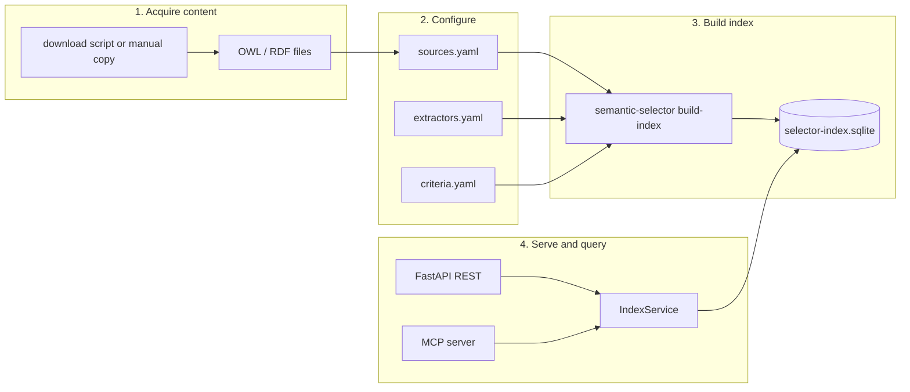
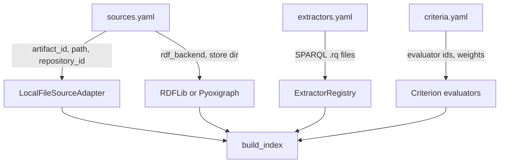
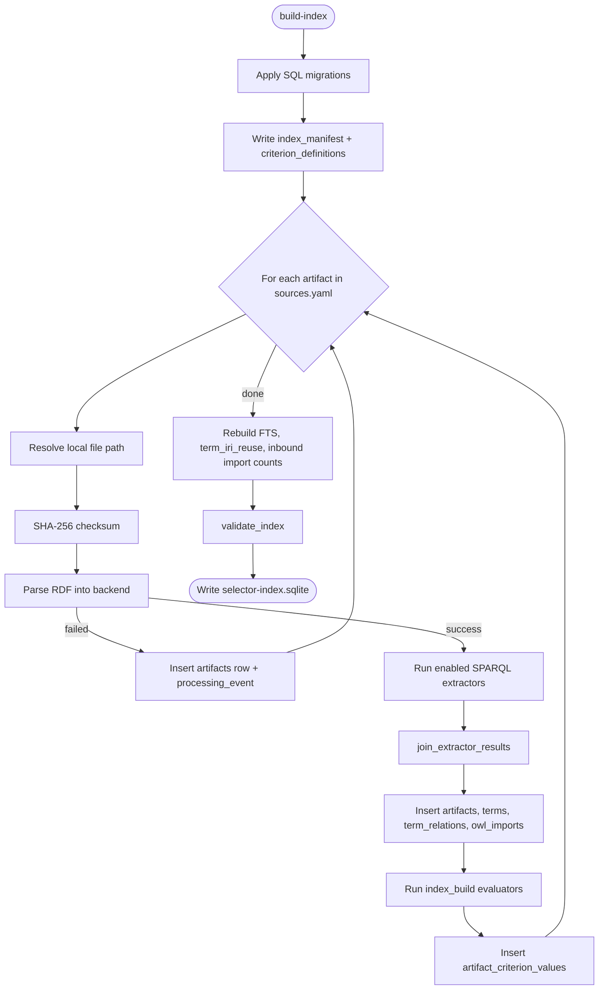
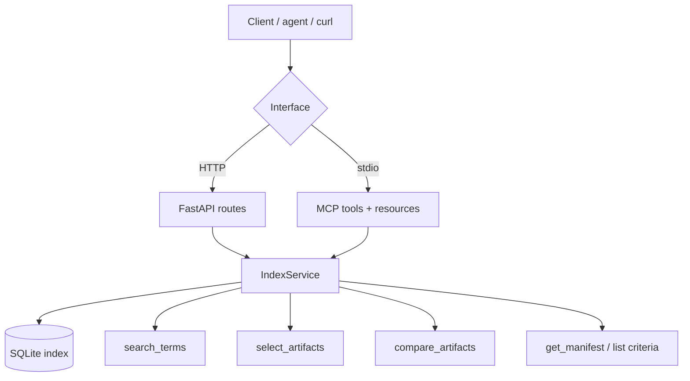
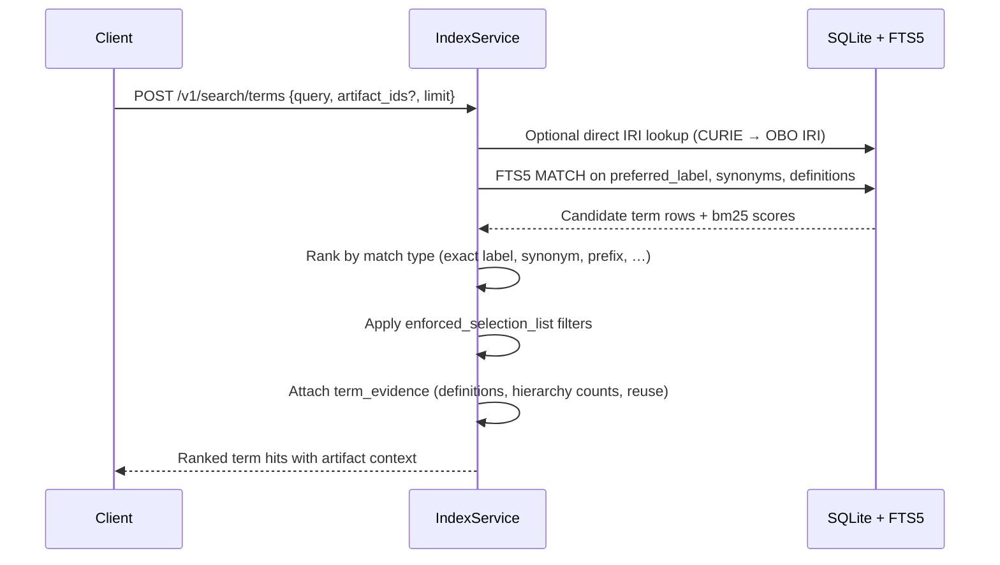
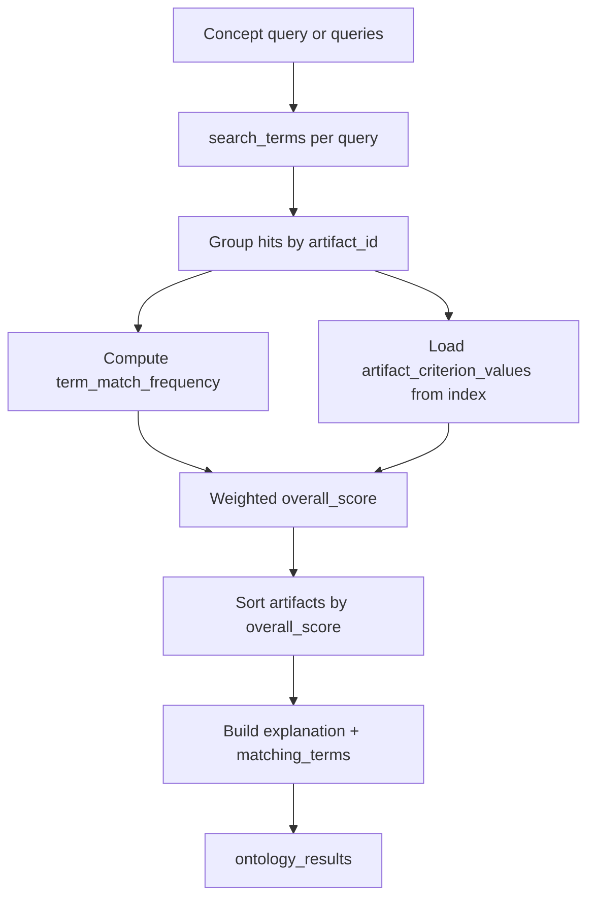
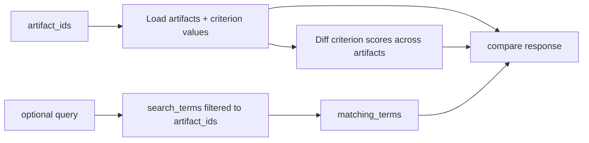
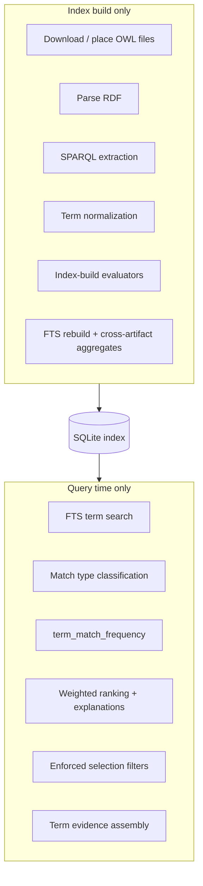
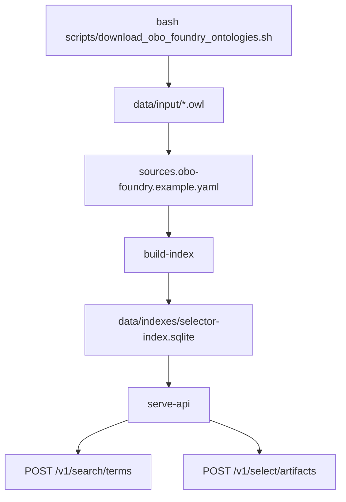

# Ontology content workflow

This document describes the end-to-end path from **obtaining ontology files** through **building a derived index** to **querying terms and ranking ontologies** at runtime.

For table-level detail and parsing rules, see [`database.md`](database.md). For API curl examples, see [`api-examples.md`](api-examples.md).

---

## Overview

The system splits cleanly into two phases:

| Phase | When | Reads | Produces |
|-------|------|-------|----------|
| **Index build** | Offline (`build-index`) | Source OWL/RDF files + YAML config | Portable SQLite index |
| **Query** | Online (`serve-api`, `serve-mcp`) | SQLite index only | Search hits, rankings, comparisons |

**Runtime rule:** no RDF parsing and no SPARQL execution during API or MCP requests. Everything a client needs was precomputed at build time (plus lightweight query-time scoring over indexed text).



---

## Phase 1 — Acquire ontology content

Ontologies enter the system as **local RDF files**. The MVP does not fetch remote ontologies during build; you download or copy files first, then point `sources.yaml` at them.

### Typical sources

| Source | How | Example paths |
|--------|-----|---------------|
| Demo fixtures | Shipped in repo | `data/fixtures/demo-one.ttl` |
| OBO Foundry releases | [`scripts/download_obo_foundry_ontologies.sh`](../scripts/download_obo_foundry_ontologies.sh) | `data/input/mondo.owl`, `doid.owl`, `hp.owl`, `go.owl` |
| Your own files | Copy anywhere readable | Any `.owl`, `.ttl`, `.rdf`, etc. |

Supported formats: Turtle, RDF/XML (`.owl`, `.rdf`), JSON-LD, N-Triples, N3 (see [`parser.py`](../src/semantic_selector/ingestion/parser.py)).

### Future

`BioPortalSourceAdapter` is stubbed for remote repository access but not implemented in the MVP.

---

## Phase 2 — Configure what to index

Three YAML files drive a build:



| File | Purpose |
|------|---------|
| [`config/sources*.yaml`](../config/sources.example.yaml) | Which ontology files to index, snapshot ID, RDF backend |
| [`config/extractors.example.yaml`](../config/extractors.example.yaml) | Version-controlled SPARQL queries that pull facts from parsed graphs |
| [`config/criteria.example.yaml`](../config/criteria.example.yaml) | Ranking criteria, default weights, enforced selection rules |

Each source entry becomes one **artifact** (e.g. `obo:mondo`) with provenance metadata stored in the index.

---

## Phase 3 — Build the derived index

### Command

```bash
uv run semantic-selector build-index \
  --sources config/sources.example.yaml \
  --extractors config/extractors.example.yaml \
  --criteria config/criteria.example.yaml \
  --output data/indexes/selector-index.sqlite
```

**Common configs**

| Goal | `--sources` |
|------|-------------|
| Small fixture demo (2 ontologies, fast) | `config/sources.example.yaml` |
| Four OBO Foundry ontologies (~450MB) | `config/sources.obo-foundry.example.yaml` |
| Full demo index (7 ontologies, pyoxigraph, ~1.6GB OWL) | `config/sources.demo.yaml` |

Download OWL files first when using OBO configs:

```bash
bash scripts/download_obo_foundry_ontologies.sh
```

### CLI flags

| Flag | Required | Default | Purpose |
|------|----------|---------|---------|
| `--sources` | yes | — | YAML listing ontology files and build options |
| `--extractors` | no | `config/extractors.example.yaml` | SPARQL extractor registry |
| `--criteria` | yes | — | Criterion definitions and default ranking weights |
| `--output` | no | `data/indexes/selector-index.sqlite` | Output SQLite path |
| `--quiet` | no | off | Suppress progress on stderr; print JSON report only |

### Build output

By default the command uses **two streams**:

| Stream | Content |
|--------|---------|
| **stderr** | Human-readable progress (safe to watch while building) |
| **stdout** | JSON build report (pipe to `jq` or a file) |

Progress is emitted **per artifact** and at **post-build** steps:

1. `[N/M] artifact_id` — which ontology is being processed
2. `loading RDF...` — parse or reuse cached pyoxigraph store
3. `running 10 SPARQL extractors...` / `extracted in Xs`
4. `writing SQLite index...` / `evaluating criteria...`
5. `done in Xs, N terms` — artifact finished
6. Whole-index steps: FTS rebuild, term reuse, inbound imports, validate, write file
7. `Build complete: ...` — summary line with total duration

Example (abbreviated):

```text
Building index (7 artifacts, backend=pyoxigraph) → data/indexes/selector-index.sqlite
[1/7] obo:mondo
  obo:mondo: loading RDF...
  obo:mondo: reusing cached store (3,054,374 triples)
  obo:mondo: running 10 SPARQL extractors...
  obo:mondo: extracted in 5.1s
  obo:mondo: writing SQLite index...
  obo:mondo: evaluating criteria...
  obo:mondo: done in 11.2s, 134,213 terms
...
Rebuilding full-text search index...
Computing term reuse...
Computing inbound import counts...
Validating index...
Writing index to data/indexes/selector-index.sqlite...
Build complete: 7 indexed, 466,012 terms, 118.5s → data/indexes/selector-index.sqlite
```

**JSON report** (stdout) includes `total_build_duration_seconds`, `terms_indexed`, and per-artifact `artifact_reports` (load/extract/write timings, extractor row counts). Useful fields:

- `status` — `success` or `failed`
- `artifacts_indexed` / `artifacts_failed`
- `sqlite_index_size_bytes`

Save progress + report separately:

```bash
uv run semantic-selector build-index \
  --sources config/sources.demo.yaml \
  --extractors config/extractors.example.yaml \
  --criteria config/criteria.example.yaml \
  --output data/indexes/selector-index.sqlite \
  2> build.log > build-report.json
```

JSON-only (for scripts):

```bash
uv run semantic-selector build-index ... --quiet | jq '.total_build_duration_seconds, .terms_indexed'
```

**Timing (rough):** fixture demo builds in under a second; the seven-ontology `sources.demo.yaml` index is typically **~2 minutes** when pyoxigraph stores are already cached under `data/tmp/rdf-store/`, and **much longer** on a cold first load (NCIT alone is ~800MB OWL). The build is silent until progress lines appear; long gaps usually mean heavy SPARQL extraction or SQLite writes for a large ontology.

After a successful build, validate or inspect without rebuilding:

```bash
uv run semantic-selector validate-index --index data/indexes/selector-index.sqlite
uv run semantic-selector inspect-index --index data/indexes/selector-index.sqlite
```

### Build pipeline



### What happens per artifact

1. **Materialize** — read the configured file path (no copy unless using a future remote adapter).
2. **Parse** — load triples via RDFLib (in-memory) or Pyoxigraph (on-disk store under `data/tmp/rdf-store/`).
3. **Extract** — run each enabled `.rq` file against the loaded graph.
4. **Normalize** — merge extractor rows into terms, hierarchy/mapping relations, and metadata ([`normalization.py`](../src/semantic_selector/extractors/normalization.py)).
5. **Persist** — write denormalized rows to SQLite (labels, synonyms, definitions as searchable text).
6. **Evaluate** — compute ontology-level scores (e.g. definition coverage, synonym coverage) from extracted facts.
7. **Log** — record parse, extractor, or evaluator issues in `processing_events`.

### Post-build (whole index)

After all artifacts:

- Rebuild FTS5 full-text index over term text
- Aggregate shared term IRIs into `term_iri_reuse`
- Compute cross-artifact metrics (e.g. inbound `owl:imports`)
- Validate integrity and FTS smoke test

The output is a **single portable `.sqlite` file** containing derived content only — not a redistribution of source ontologies.

### Other build commands

| Command | Role |
|---------|------|
| `build-index` | Build derived index from local OWL/RDF (see flags above) |
| `init-db` | Create empty schema (no content) |
| `validate-index` | Check manifest, orphans, FTS |
| `inspect-index` | Print snapshot summary |

---

## Phase 4 — Serve and query

Point a long-running process at the built index:

```bash
# REST API
uv run semantic-selector serve-api --index data/indexes/selector-index.sqlite

# MCP (stdio, for agents)
uv run semantic-selector serve-mcp --index data/indexes/selector-index.sqlite
```

Both interfaces use the same [`IndexService`](../src/semantic_selector/services.py) — read-only SQLite access, no RDF reload.



---

## Query workflows

### Term search

**Use when:** finding concepts by label, synonym, definition snippet, or CURIE (e.g. `MONDO:0005148`).



**Indexed fields used:** `terms`, `terms_fts`, `artifacts`, `term_iri_reuse`.

**Not used at query time:** source OWL files, SPARQL, RDF backends.

REST: `POST /v1/search/terms`  
MCP: `search_semantic_terms`

---

### Ontology selection (ranking)

**Use when:** choosing which ontology best covers one or more concept queries (e.g. “diabetes mellitus” + “seizure”).



Default weights (overridable in request):

| Criterion | Default weight | Computed |
|-----------|---------------:|----------|
| `term_match_frequency` | 0.60 | Query time — share of concept queries with at least one term hit |
| `definition_coverage` | 0.40 | Index build — stored in `artifact_criterion_values` |

Additional criteria (synonym coverage, inbound imports, multilanguage annotations, etc.) appear as evidence; only criteria with non-zero request weights affect `overall_score`.

REST: `POST /v1/select/artifacts`  
MCP: `recommend_semantic_artifacts`

---

### Artifact comparison

**Use when:** side-by-side criterion values for a fixed set of ontologies, optionally with overlapping term search.



REST: `POST /v1/compare/artifacts`  
MCP: `compare_semantic_artifacts`

---

### Metadata and registry

| Need | REST | MCP |
|------|------|-----|
| Snapshot provenance | `GET /v1/index/manifest` | `get_selector_index_manifest`, resource `selector://index/manifest` |
| Criterion definitions | `GET /v1/criteria` | resource `selector://criteria` |
| Single artifact record | `GET /v1/artifacts/{id}` | resource `selector://artifact/{id}` |

---

## Build-time vs query-time responsibilities



| Data | Built at index time | Used at query time |
|------|--------------------|--------------------|
| Term labels, synonyms, definitions | Yes | Yes (search) |
| Hierarchy / mapping counts | Yes | Yes (term evidence) |
| Definition / synonym coverage scores | Yes | Yes (ranking) |
| Term match frequency | — | Yes (computed from search hits) |
| Source OWL triples | Parsed then discarded* | No |

\* Pyoxigraph may retain an on-disk store after build if configured; it is not consulted during API/MCP requests.

---

## End-to-end example (OBO Foundry)



1. Download MONDO, DOID, HP, GO (or use `sources.demo.yaml` for seven ontologies including EFO, NCIT, OBI).
2. Run `build-index` with the matching sources config; watch stderr for progress (~minutes depending on size and cache).
3. Serve API against the output index.
4. Search terms across all ontologies or filter with `artifact_ids`.
5. Rank ontologies for a clinical concept query to see which artifact best matches.

See [Phase 3 — Build the derived index](#phase-3--build-the-derived-index) for flags, progress output, and timing notes.

---

## Related docs

- [`database.md`](database.md) — ER diagram, table reference, extractor-to-column mapping
- [`architecture.md`](architecture.md) — layer summary and design principles
- [`criterion-registry.md`](criterion-registry.md) — OntoChoice-aligned criteria roles and weights
- [`api-examples.md`](api-examples.md) — curl examples for each endpoint
